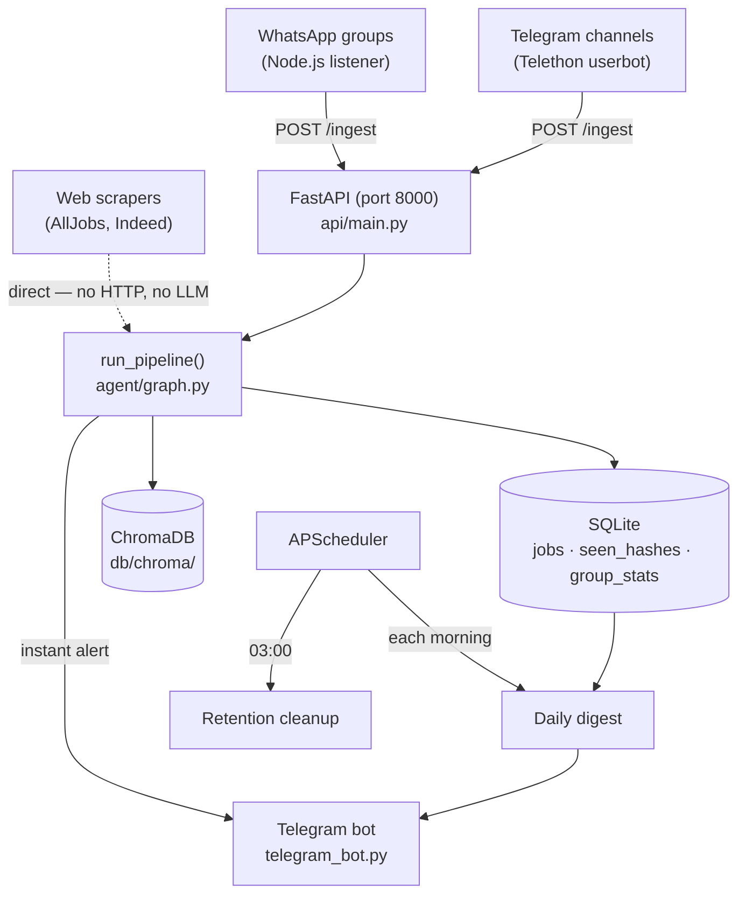

# 🕵️ Job Screening Agent

[](docs/SETUP.md)
[](agent/graph.py)
[](agent/chains/llm_factory.py)
[](api/main.py)
[](package.json)
[](db/schema.sql)
[](agent/vector_store.py)
[](tests)

A single-user LangChain learning project that watches WhatsApp groups, Telegram channels, and job
boards for job postings, filters them against your own preferences, and delivers instant Telegram
alerts plus a daily digest.

Messages come from three independent source types — a Node.js WhatsApp listener, a Telethon
Telegram userbot, and HTML/RSS web scrapers — but only WhatsApp and Telegram messages reach an
LLM. Web-scraped jobs are already structured, so they skip the model entirely and go straight
through dedup → filter → store → notify.

**Live demo (when the agent is running):** [@myjobscreener_bot](https://t.me/myjobscreener_bot) —
try `/ask python jobs this week` or `/jobs`

## 📑 Table of Contents

- [🏗️ Architecture](#-architecture)
- [🧠 Pipeline](#-pipeline)
- [💻 Local Development](#-local-development)
- [🔑 Environment Variables](#-environment-variables)
- [🧪 Testing](#-testing)
- [📁 Repo Layout](#-repo-layout)
- [👤 Author](#-author)

## 🏗️ Architecture



- **WhatsApp listener** (`sources/whatsapp/listener.js`) — `whatsapp-web.js`, QR auth, a 2-minute
  reconnect heartbeat, and catch-up replay of missed messages on restart.
- **Telegram source listener** (`sources/telegram/listener.py`) — a Telethon userbot that watches
  broadcast channels and replays up to 48 h of missed messages on startup.
- **Web scrapers** (`sources/web/listener.py`, `sources/web/scrapers/`) — poll AllJobs and Indeed
  on a configurable interval and extract structured job fields directly from HTML/RSS. They never
  call the LLM or the ingest API; they run the same dedup → filter → store → notify tools in
  process.
- **FastAPI ingest** (`api/main.py`) — `POST /ingest` receives `{group, sender, text, timestamp}`
  from the WhatsApp and Telegram listeners. Failures are retried in memory (3 attempts, 30 s / 2
  min / 5 min backoff) so a network blip never drops a message.
- **Pipeline** (`agent/graph.py`) — a LangGraph `StateGraph` that classifies, extracts, deduplicates,
  filters, stores, and notifies. See [Pipeline](#-pipeline) below.
- **SQLite** (`db/schema.sql`) — `jobs`, `seen_hashes` (dedup), and `group_stats` (drives adaptive
  mode selection).
- **ChromaDB** (`agent/vector_store.py`) — `all-MiniLM-L6-v2` embeddings for `/similar` search and
  cross-source near-duplicate detection, persisted to `db/chroma/`.
- **Telegram bot** (`telegram_bot.py` + `telegram_handlers/`) — commands for preferences, watched
  sources, natural-language queries (`/ask`), and inline "block role" / "block city" buttons.
- **APScheduler** (`digest/digest.py`) — fires the daily digest each morning and a retention
  cleanup at 03:00 that purges expired dedup hashes and delivered jobs past the retention window.

## 🧠 Pipeline

The `route` node picks a mode per WhatsApp/Telegram group via `get_pipeline_mode()`
(`agent/tools/stats_tool.py`):

| Mode | When | LLM calls |
|---|---|---|
| `separate` | Default, and any group under 50 messages | 2 — classify, then extract |
| `combined` | Group has ≥ 50 messages and ≥ 70% are job posts | 1 — classify + extract together |

Every extracted job then runs through **dedup → filter → store → notify**
(`agent/tools/dedup_tool.py`, `filter_tool.py`, `store_tool.py`), with a vector-similarity check in
`agent/vector_store.py` catching near-duplicates that hash-based dedup misses.

LLM calls go through LangChain's `with_structured_output()`, which for Anthropic compiles to a
forced tool call — the JSON schema is enforced by the provider at generation time, not by prompt
text alone. The provider factory (`agent/chains/llm_factory.py`) reads `LLM_PROVIDER` and
`LLM_MODEL` and supports `anthropic` (default), `openai`, `google`, and `ollama`. Prompt caching
(`PROMPT_CACHE_TTL`) is Anthropic-only and is silently ignored for other providers — see
[`docs/PROMPT_CACHING.md`](docs/PROMPT_CACHING.md) for the break-even math.

## 💻 Local Development

**Prerequisites:** Python 3.9+, Node.js 18+, and an API key for your chosen LLM provider (see
[`docs/SETUP.md`](docs/SETUP.md) for the full comparison).

1. Clone the repo, then set up the Python and Node environments:

   ```bash
   python -m venv venv
   venv\Scripts\activate        # Windows
   # source venv/bin/activate   # Mac / Linux
   pip install -r requirements.txt
   npm install
   ```

2. Create `.env` and fill in your LLM provider key (see
   [Environment Variables](#-environment-variables)):

   ```bash
   copy .env.example .env       # Windows
   # cp .env.example .env       # Mac / Linux
   ```

3. Initialize the SQLite database:

   ```bash
   python -m db.init_db
   ```

4. Edit `agent/prefs.json` with the roles you want and the roles/cities you want blocked.

5. Start every process (API, WhatsApp listener, Telegram bot, digest scheduler, web scrapers):

   ```bash
   python start.py
   ```

   First run shows a QR code in the terminal — scan it with WhatsApp (Settings → Linked Devices →
   Link a Device). Auth is saved to `sources/whatsapp/.wwebjs_auth/` and reused on later runs.

   **Windows:** double-click `Start Job Screener.bat`. **macOS/Linux:** `bash "Start Job Screener.sh"`.

Full walkthrough, including the `python setup.py` interactive wizard and Telegram source
authentication, is in [`docs/SETUP.md`](docs/SETUP.md).

## 🔑 Environment Variables

Copy `.env.example` to `.env` and fill in. Full descriptions are in
[`docs/SETUP.md`](docs/SETUP.md).

| Variable | Required | Default | Purpose |
|---|---|---|---|
| `LLM_PROVIDER` | No | `anthropic` | `anthropic`, `openai`, `google`, or `ollama` |
| `LLM_MODEL` | No | provider's default | Override the model for the chosen provider |
| `ANTHROPIC_API_KEY` | If using Anthropic | — | Claude API access |
| `OPENAI_API_KEY` | If using OpenAI | — | OpenAI API access |
| `GOOGLE_API_KEY` | If using Google | — | Gemini API access |
| `TELEGRAM_BOT_TOKEN` | No (recommended) | — | Instant alerts, digest, bot commands |
| `TELEGRAM_CHAT_ID` | No (recommended) | — | Telegram recipient / owner |
| `TELEGRAM_API_ID` / `TELEGRAM_API_HASH` / `TELEGRAM_PHONE` | No | — | Telegram source listener (Telethon) |
| `WEB_SCRAPER_INTERVAL_MINUTES` | No | `30` | Web scraper poll interval |
| `JOBS_DB_PATH` | No | `db/jobs.db` | Override the SQLite path |
| `PROMPT_CACHE_TTL` | No | `off` | Anthropic-only prompt cache TTL in seconds |
| `DUPLICATE_WINDOW_DAYS` | No | `7` | Days back to check for same title+company; `0` disables |
| `INGEST_API_URL` | No | `http://localhost:8000/ingest` | Endpoint listeners post to |
| `LANGSMITH_TRACING` / `LANGSMITH_API_KEY` / `LANGSMITH_PROJECT` | No | — | Optional LangSmith tracing |

## 🧪 Testing

**Python (122 tests)** — all run offline. Chain functions are mocked at the `AsyncMock` level; the
rest of the pipeline runs against a temp SQLite DB, and ChromaDB is tested with a
`_FakeEmbeddingFunction`.

```bash
pytest tests/ -v                                              # all tests
pytest tests/test_pipeline.py -v                              # pipeline only
pytest tests/test_pipeline.py::test_stores_a_qualified_job    # single test
python -m agent.pipeline                                      # live smoke test (needs API key)
```

**Node.js (14 tests)** — Jest tests for `sources/whatsapp/last_seen.js`.

```bash
npm test
```

## 📁 Repo Layout

```
agent/
  pipeline.py        Entry point — run_pipeline() → LangGraph
  graph.py            LangGraph StateGraph — nodes, edges, routing, Telegram notify
  prefs.json           User preferences (roles, blocklist, location_blocklist)
  chains/               llm_factory · classifier · extractor · combined · cache_config
  tools/                filter · dedup · store · cleanup · stats · prefs · groups ·
                         telegram_sources · query · ask
  list_jobs.py         CLI: python -m agent.list_jobs [--days N] [--role KW] [--unseen]
  vector_store.py      index_job() + find_similar() + reindex_all() + delete_jobs()

api/
  main.py              FastAPI: POST /ingest, GET /healthz, retry queue

sources/
  whatsapp/             listener.js (whatsapp-web.js) + last_seen.js
  telegram/              listener.py (Telethon userbot)
  web/                    listener.py (APScheduler poller) + scrapers/ (AllJobs, Indeed)

digest/
  digest.py            Daily digest (format + send via Telegram) + retention cleanup schedule

telegram_bot.py       Thin dispatcher; commands live in telegram_handlers/
telegram_handlers/    start · jobs · prefs · groups · sources · callbacks

db/
  schema.sql           SQLite schema (jobs, seen_hashes, group_stats)
  init_db.py            python -m db.init_db

docs/
  SETUP.md             Full setup guide
  PROMPT_CACHING.md    Caching options + break-even math

tests/                122 Python tests (offline) + Jest tests for the last-seen module
Start Job Screener.bat / Start Job Screener.sh   Launchers (Windows / macOS-Linux)
```

## 👤 Author

**Yarin Solomon** — Full Stack Developer

- Email: [yarinso39@gmail.com](mailto:yarinso39@gmail.com)
- GitHub: [github.com/yarins0](https://github.com/yarins0)
- LinkedIn: [linkedin.com/in/yarin-solomon](https://www.linkedin.com/in/yarin-solomon/)
- Portfolio: [yarin-lab](https://yarin-lab.vercel.app/)
