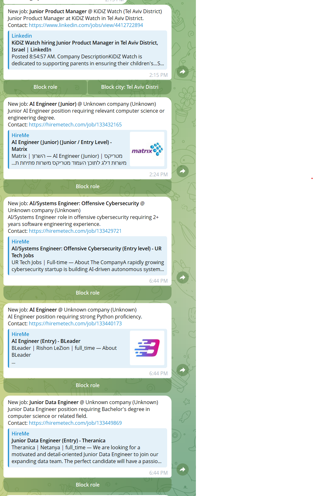
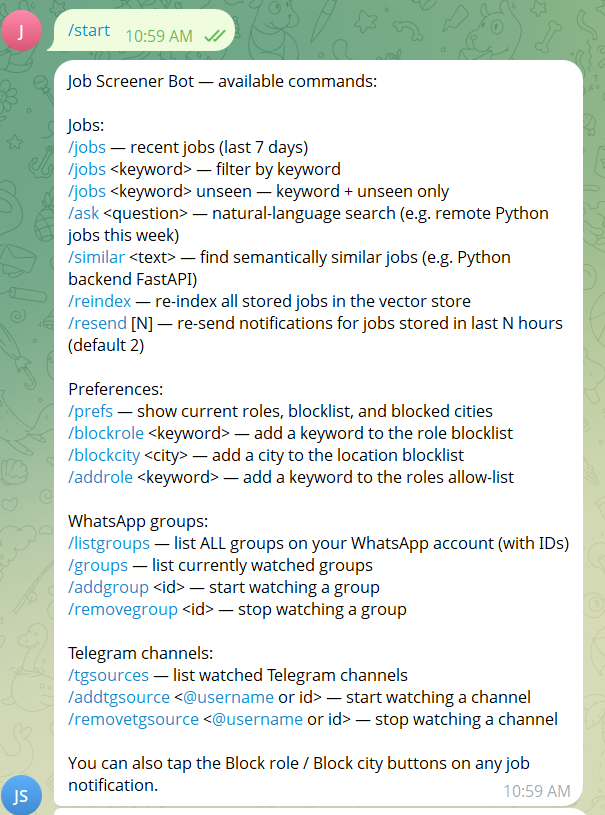

# Job Screening Agent

Monitors WhatsApp groups, Telegram channels, and job boards for job postings.
Extracts structured data, filters by your preferences, and delivers instant
Telegram alerts and a daily digest.

**Live demo (when agent is running):** [@myjobscreener_bot](https://t.me/myjobscreener_bot) — try `/ask python jobs this week` or `/jobs`

---

## Screenshots

<table>
  <tr>
    <td align="center"><b>Job notifications</b></td>
    <td align="center"><b>Bot commands</b></td>
  </tr>
  <tr>
    <td></td>
    <td></td>
  </tr>
</table>

---

## Getting started

See **[docs/SETUP.md](docs/SETUP.md)** for the full setup guide — prerequisites,
environment variables, WhatsApp auth, Telegram configuration, and LangSmith observability.

---

## Architecture

```
WhatsApp Groups  ──┐
Telegram Channels ─┤──► POST /ingest (FastAPI) ──► Pipeline ──► SQLite ──► Telegram (instant alert)
Web Scrapers ──────┘         (api/main.py)          (graph.py)       ↓
                                                                 Daily digest
                                                               (APScheduler)
```

### Pipeline (`agent/graph.py`)

LangGraph `StateGraph` with adaptive mode selection per group:

| Mode | When | LLM calls |
|---|---|---|
| `separate` | Default (new groups) | 2 — classify, then extract |
| `combined` | Group ≥ 70% job posts | 1 — classify + extract together |

Per extracted job: **dedup → filter → store → notify**

### LLM chains (`agent/chains/`)

LangChain `with_structured_output()` with Pydantic-enforced outputs — works with
any supported provider. The provider factory (`agent/chains/llm_factory.py`) reads
`LLM_PROVIDER` and `LLM_MODEL` from `.env` and returns the right model. Defaults to
Anthropic Claude Haiku. Supports `anthropic`, `openai`, `google`, and `ollama`.

Prompt caching (`PROMPT_CACHE_TTL`) is Anthropic-only and is silently ignored for
other providers. See **[docs/PROMPT_CACHING.md](docs/PROMPT_CACHING.md)** for options and break-even math.

---

## Tech stack

| Layer | Technology |
|---|---|
| WhatsApp source | Node.js + `whatsapp-web.js` — QR auth, catch-up replay, heartbeat |
| Telegram source | Python + Telethon userbot — watches channels, catch-up replay |
| Web scraper source | Python + BeautifulSoup — structured HTML extraction, no LLM |
| API / ingest | Python + FastAPI + in-memory retry queue (3 attempts, backoff) |
| LLM calls | LangChain `with_structured_output()` — provider-agnostic, Pydantic structured outputs |
| Pipeline orchestration | LangGraph `StateGraph` |
| LLM provider | Anthropic (default), OpenAI, Google Gemini, or Ollama — set via `LLM_PROVIDER` + `LLM_MODEL` |
| Database | SQLite — `jobs`, `seen_hashes`, `group_stats` |
| Vector search | ChromaDB — `all-MiniLM-L6-v2` embeddings, persisted to `db/chroma/` |
| Scheduler | APScheduler — daily digest + daily retention cleanup + web scraper polling |
| Telegram bot | Long-polling — commands + inline buttons |
| Observability | LangSmith (optional) |

---

## Tests

**Python (122 tests)** — all run offline, no API key needed. Chain functions are
mocked at the `AsyncMock` level; the rest of the pipeline (LangGraph, tools, storage)
runs against a temp SQLite DB. ChromaDB is tested with a `_FakeEmbeddingFunction`.

```bash
pytest tests/ -v                                              # all tests
pytest tests/test_pipeline.py -v                             # pipeline only
pytest tests/test_pipeline.py::test_stores_a_qualified_job   # single test
python -m agent.pipeline                                      # live smoke test (needs API key)
```

**Node.js (14 tests)** — Jest tests for `sources/whatsapp/last_seen.js`.

```bash
npm test
```

---

## Project layout

```
agent/
  pipeline.py        Entry point — run_pipeline() → LangGraph
  graph.py           LangGraph StateGraph — nodes, edges, routing, Telegram notify
  prefs.json         User preferences (roles, blocklist, location_blocklist)
  chains/
    llm_factory.py   Provider factory — get_llm(), build_system_message()
    classifier.py    classify_message() — is_job_post + confidence
    extractor.py     extract_job()      — list of JobPost dicts
    combined.py      classify_and_extract() — single-call mode
    cache_config.py  PROMPT_CACHE_TTL toggle (off / 5m / 1h / auto) — Anthropic only
  list_jobs.py       CLI: python -m agent.list_jobs [--days N] [--role KW] [--unseen]
  tools/
    filter_tool.py          Match job against prefs.json
    dedup_tool.py           Hash-based dedup (structured + raw)
    store_tool.py           Insert job into jobs table + ChromaDB; mark_seen()
    cleanup_tool.py         Retention purge — old hashes + delivered jobs
    stats_tool.py           Per-group job-post rate; drives adaptive mode
    prefs_tool.py           load/mutate prefs.json
    groups_tool.py          load/mutate whatsapp_sources.json
    telegram_sources_tool.py load/mutate telegram_sources.json
    query_tool.py           query_jobs() + format_jobs_telegram()
    ask_tool.py             Natural-language query → query_jobs()
  vector_store.py    index_job() + find_similar() + reindex_all() + delete_jobs()

api/
  main.py            FastAPI: POST /ingest, GET /healthz, retry queue

sources/
  whatsapp/
    listener.js      whatsapp-web.js client — QR auth, heartbeat, catch-up replay
    last_seen.js     Per-group timestamp state (path-injectable for tests)
  telegram/
    listener.py      Telethon userbot — watches channels, catch-up replay
  web/
    listener.py      APScheduler poller
    scrapers/
      alljobs.py     AllJobs.co.il (disabled by default in web_sources.json)
      indeed.py      Indeed Israel RSS (disabled — 403)

digest/
  digest.py          Daily digest (format + send via Telegram) + schedules retention cleanup

telegram_bot.py      Commands: /help /prefs /blockrole /blockcity /addrole
                               /groups /addgroup /removegroup
                               /tgsources /addtgsource /removetgsource
                               /jobs /ask /similar /reindex /listgroups

db/
  schema.sql         SQLite schema (jobs, seen_hashes, group_stats)
  init_db.py         python -m db.init_db

docs/
  SETUP.md           Full setup guide
  PROMPT_CACHING.md  Caching options + break-even math

Start Job Screener.bat   Windows launcher (double-click or shortcut)
start.sh                 macOS / Linux launcher (bash start.sh)

tests/               122 Python tests (offline)
```

---

## Author

**Yarin Solomon** — Full Stack Developer

- Email: [yarinso39@gmail.com](mailto:yarinso39@gmail.com)
- GitHub: [github.com/yarins0](https://github.com/yarins0)
- LinkedIn: [linkedin.com/in/yarin-solomon](https://www.linkedin.com/in/yarin-solomon/)
- Portfolio: [yarin-lab](https://yarin-lab.vercel.app/)
